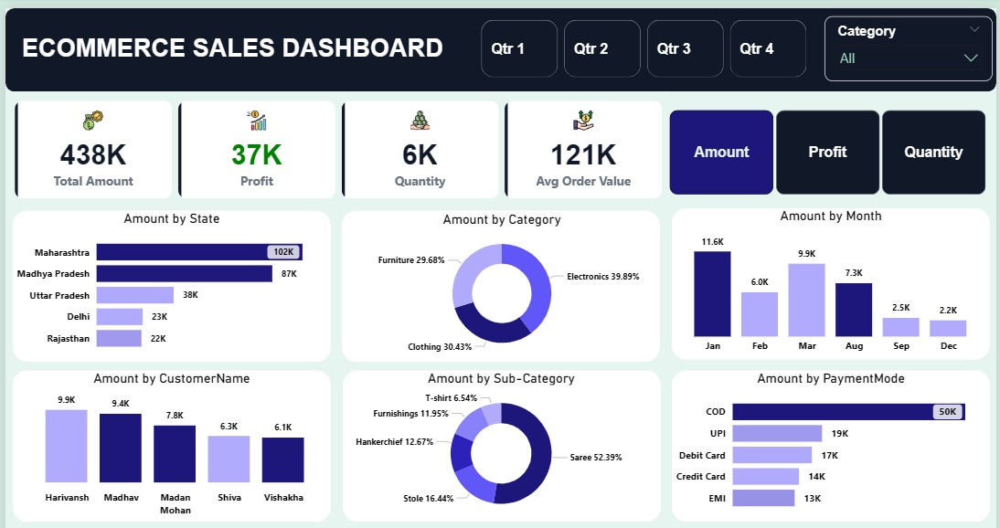

# 📊 E-commerce Sales Analysis Dashboard

A comprehensive **Power BI Dashboard** designed to analyze and visualize e-commerce sales performance. This project transforms raw sales data into actionable business intelligence to help stakeholders track KPIs, optimize inventory, and understand customer behavior.

---

## 🚀 Project Overview
This dashboard provides a high-level summary of sales, profits, and customer trends. It is built using **Power BI**, utilizing **Power Query** for data transformation and **DAX** for complex measures.

### 📊 Key Performance Indicators (KPIs)
* **Total Sales:** $438K 💰
* **Total Profit:** $37K 📈
* **Order Quantity:** 5,615 Units 📦
* **Average Order Value (AOV):** $121K 💵

---

## 🔍 Key Insights & Visualizations

### 1. Sales & Profit Trends
* **Monthly Performance:** Analyzed sales fluctuations over time, identifying **January** as the peak month for profitability.
* **Category Breakdown:** Clothing represents the largest share (**63%**), followed by Electronics (**21%**).

### 2. Geographic Analysis
* A detailed map visualization identifies **Maharashtra** and **Madhya Pradesh** as top-performing states.

### 3. Customer & Payment Behavior
* **Top Customers:** Tracked performance of key buyers like **Harivansh** and **Madhav**.
* **Payment Methods:** Visualized customer preferences across **COD, UPI, Credit Card,** and **EMI**, with Cash on Delivery being the most utilized.

---

## 🛠️ Tools & Technologies Used
* **Power BI Desktop:** For report authoring and dashboard design.
* **Power Query:** For ETL (Extract, Transform, Load) processes and data cleaning.
* **DAX (Data Analysis Expressions):** Created custom measures for profit margins and YTD calculations.

---

## 📂 How to Use
1. Download the `Project.pbix` file from this repository.
2. Open the file in **Power BI Desktop**.
3. Explore the interactive filters (State, Category, and Date) to deep dive into specific data points.

---

## 👤 Author
**Md Idris (Shawon)**
*Junior Data Analyst*
* Expertise: Power BI, Excel (DAX/Power Query), and Python.

---
